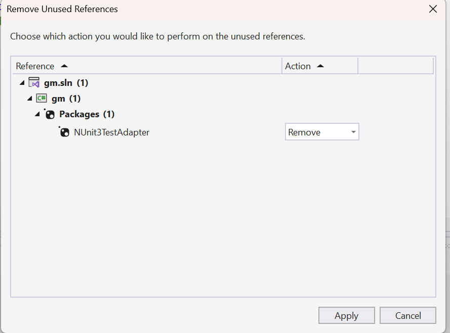

# Repro for the Remove Unused References issue

The `Remove Unused References` feature give false positives on some tool components. 

In the code here, the NUnit3Adapter3 is flagged as a candidate for removal.
This tool component is used by the test runner to execute NUnit tests, so it is not a removable reference

If you replace it with version 4.6.0, it is not flagged.
The difference is that 5.0.0 includes the MTP (Microsoft Testing Platform) components, 
and it appears that those assemblies (many of them) trigger the incorrect detection.

No other tool components are flagged in this repro.

I have seen similar cases before, which suggests an underlying issue; this example reproduces the problem reliably.

We have an issue here for this: https://github.com/nunit/nunit3-vs-adapter/issues/1277

If you add an ExcludeAssets clause to the reference, it is not flagged, but instead you get a warning and MTP probably don't work.

```xml
    <PackageReference Include="NUnit3TestAdapter" Version="5.0.0">
       <ExcludeAssets>runtime; build; native; contentfiles; analyzers</ExcludeAssets>  
    </PackageReference>
```


